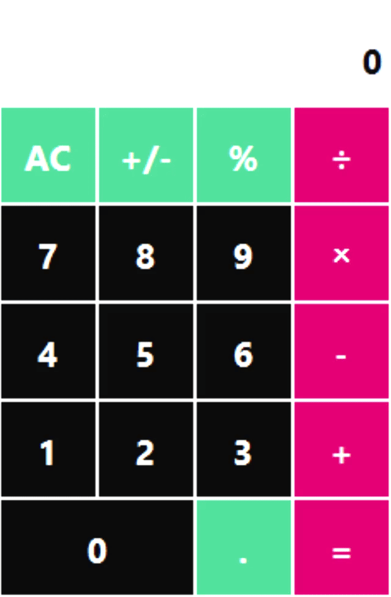

# Calculator

## 🚀 Features

This is a calculator made in Qt with basic operations:
- **addition**
- **subtraction** 
- **multiplication**
- **division**
- **sign change** 
- **percent taking**
> ⚠️ After pressing an operation and entering a number, you must press the equals sign!

## 📥 Download latest release 

Install Calculator.zip unzip it on your desktop and transfer the internal contents of the folder to your desktop. The program will run by clicking on the shortcut, but you can run it via .exe.

[](https://github.com/1123581321345589144233377610/Calculator/releases)
[](https://github.com/1123581321345589144233377610/Calculator/releases)

## 📦 Installation from source

```bash
git clone https://github.com/1123581321345589144233377610/Calculator.git
cd Calculator
```
## 🎥 Demo



## 👤 Author

**Dima M. Shirokov**
- [GitHub](https://github.com/1123581321345589144233377610)
